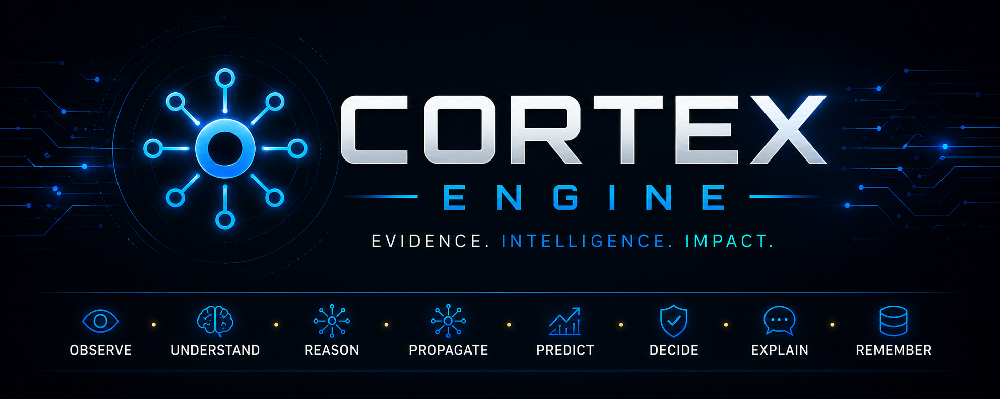
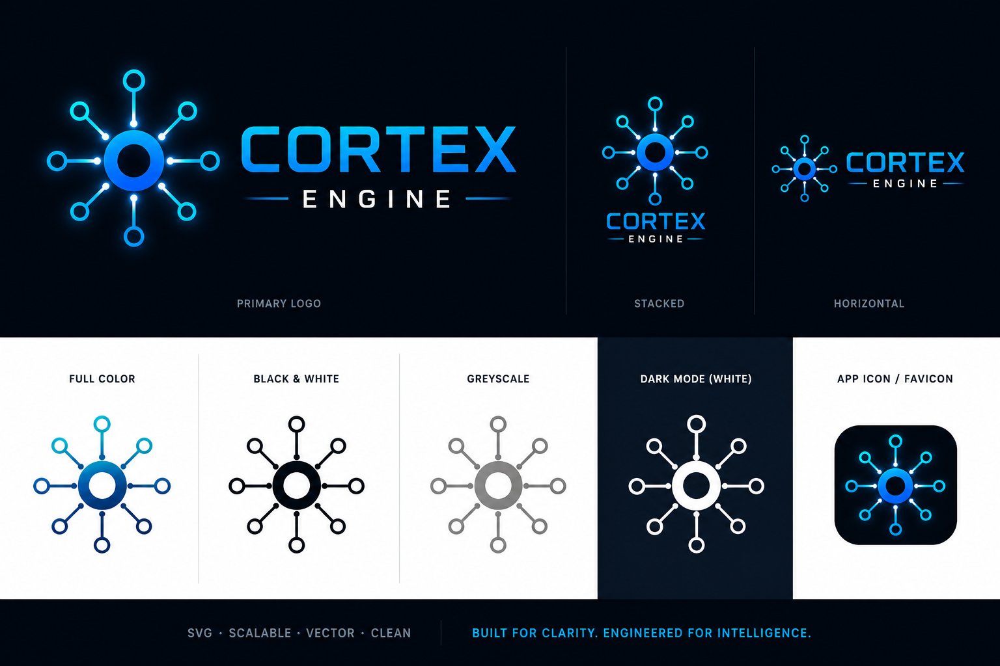

<p align="center">
  
</p>


---

# 🏈 GridironGPT


### Fantasy Football Intelligence Platform

**Introducing Gridiron Cortex**

GridironGPT transforms NFL news, injuries, roster movement, and player developments into explainable fantasy football intelligence through a modular AI reasoning engine.

---

## Contents

- [Overview](#overview)
- [Intelligence Pipeline](#-intelligence-pipeline)
- [Powered by Gridiron Cortex](#-powered-by-gridiron-cortex)
- [Core Features](#-core-features)
- [Architecture](#-architecture)
- [Technology Stack](#-technology-stack)
- [Project Structure](#-project-structure)
- [Getting Started](#getting-started)
- [Usage](#usage)
- [Roadmap](#-roadmap)
- [License](#license)

---

## Overview

GridironGPT continuously monitors NFL news and football data, transforming raw information into structured intelligence for fantasy football managers.

Rather than relying solely on rankings or keyword matching, the platform evaluates evidence, calibrates confidence, propagates impacts across related players and teams, predicts downstream effects, and produces explainable recommendations.

At the heart of the platform is **Gridiron Cortex**, a modular intelligence engine designed for scalable AI reasoning.


## 🚧 Current Status

GridironGPT is under active development.

Recent milestones include:

- ✅ Gridiron Cortex intelligence engine
- ✅ Evidence aggregation
- ✅ Confidence calibration
- ✅ Prediction engine
- ✅ Historical player scorecards
- 🚧 Multi-source ingestion expansion
- 🚧 Knowledge graph enrichment

---

## 🧠 Intelligence Pipeline

```text
    ┌───────────┐
    │ NFL News  │
    └─────┬─────┘
          │
          ▼
┌────────────────────┐
│ Evidence Analysis  │
└─────────┬──────────┘
          │
          ▼
┌────────────────────┐
│ Confidence Engine  │
└─────────┬──────────┘
          │
          ▼
┌────────────────────┐
│ Entity Resolution  │
└─────────┬──────────┘
          │
          ▼
┌────────────────────┐
│ Signal Processing  │
└─────────┬──────────┘
          │
          ▼
┌────────────────────┐
│ Relationship Graph │
└─────────┬──────────┘
          │
          ▼
┌────────────────────┐
│ Score Engine       │
└─────────┬──────────┘
          │
          ▼
┌────────────────────┐
│ Prediction Engine  │
└─────────┬──────────┘
          │
          ▼
┌────────────────────┐
│ Recommendation AI  │
└─────────┬──────────┘
          │
          ▼
┌────────────────────┐
│ Explainable Output │
└────────────────────┘
```
---

## 🧠 Powered by Gridiron Cortex

<p align="center">
  
</p>
Gridiron Cortex is the intelligence engine that powers GridironGPT.

Rather than relying on simple keyword matching, Cortex transforms football news into structured intelligence through a modular reasoning pipeline.

Its architecture includes:

- Evidence aggregation
- Confidence calibration
- Entity resolution
- Signal propagation
- Knowledge graph reasoning
- Prediction engine
- Recommendation engine
- Explainable AI

---

## ✨ Core Features

- 📰 Multi-source NFL news ingestion
- 🧠 AI-powered evidence analysis
- 📈 Confidence calibration
- 👤 Player and team entity resolution
- 🔗 Relationship propagation
- 📊 Historical score tracking
- 🎯 Prediction engine
- 💡 Explainable recommendations
- 📚 Knowledge graph integration
- ⚡ Modular Cortex architecture

---

## 🏗️ Architecture

GridironGPT is organized into independent components that separate data ingestion, intelligence processing, prediction, and presentation.

This modular architecture allows new data sources, reasoning engines, and user interfaces to be added with minimal impact on the rest of the platform.

*Architecture diagram coming soon.*

---

## 🛠 Technology Stack

### Artificial Intelligence

- Ollama
- Large Language Models (LLMs)
- Retrieval-Augmented Generation (RAG)
- Knowledge Graphs
- Rule-Based Reasoning

### Backend

- Python
- Streamlit
- FAISS
- JSON
- RSS

### Development

- Git
- GitHub
- pytest

---

## 📁 Project Structure

```text
gridiron_gpt/
├── gridiron_cortex/    # Intelligence engine
├── data_ingest/        # NFL news ingestion
├── semantic/           # Embeddings & retrieval
├── pipelines/          # Processing workflows
├── interface/          # User interfaces
├── dashboard/          # Streamlit application
├── tests/              # Automated testing
└── assets/             # Branding & documentation
```

---

## Getting Started

```bash
git clone git@github.com:phredogee/GridironGPT.git

cd GridironGPT

python -m venv venv

source venv/bin/activate

pip install -r requirements.txt
```

---

## Usage

Launch the Streamlit dashboard:

```bash
streamlit run streamlit_app.py
```

Additional CLI commands and API examples will be documented as development progresses.

---

## 🚀 Roadmap

- [x] Multi-source news ingestion
- [x] Entity resolution
- [x] Signal propagation
- [x] Confidence calibration
- [x] Explainable recommendations
- [ ] Knowledge graph expansion
- [ ] Historical trend analysis
- [ ] Draft intelligence dashboard
- [ ] Cloud deployment

---

## Contributing

GridironGPT is an active project. Contributions, ideas, and discussions are welcome as the platform continues to evolve.

---

## License

This project is licensed under the MIT License.
